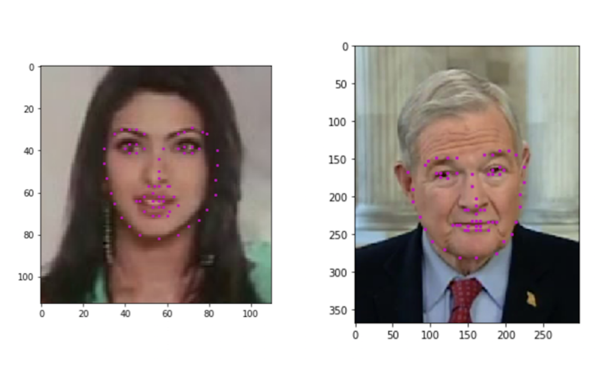

# Facial Keypoint Detection
## Udacity's Computer Vision Nanodegree

### Project Overview
In this project, you’ll combine your knowledge of computer vision techniques and deep learning architectures to build a facial keypoint detection system that takes in any image with faces, and predicts the location of 68 distinguishing keypoints on each face!

Facial keypoints include points around the eyes, nose, and mouth on a face and are used in many applications. These applications include: facial tracking, facial pose recognition, facial filters, and emotion recognition. Your completed code should be able to look at any image, detect faces, and predict the locations of facial keypoints on each face. Some examples of these keypoints are pictured below.

Python notebooks for the project:

Notebook 1 : Loading and Visualizing the Facial Keypoint Data

Notebook 2 : Defining and Training a Convolutional Neural Network (CNN) to Predict Facial Keypoints

Notebook 3 : Facial Keypoint Detection Using Haar Cascades and your Trained CNN

Notebook 4 : Fun Filters and Keypoint Uses
